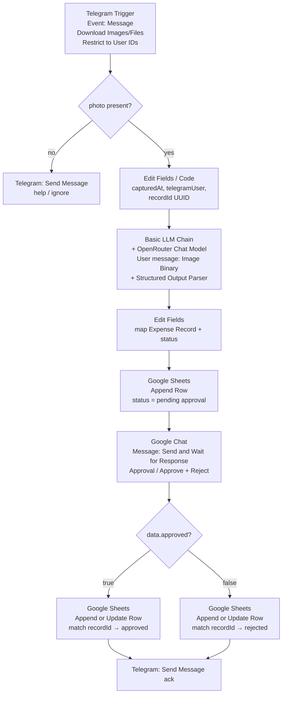

# Research: Telegram → OpenRouter vision → Sheets → Google Chat approval (n8n)

**Date:** 2026-07-26  
**Repo context:** self-hosted n8n via docker-compose; Google Sheets already in use; `WEBHOOK_URL` / ngrok pattern already documented; OpenRouter for this path (not local Ollama).  
**Domain language:** see `CONTEXT.md` (Expense Photo, Expense Record, Allowed Submitter, Approval Request).

## 1. Summary recommendation

Use one active n8n workflow: **Telegram Trigger** (Message + download images + **Restrict to User IDs**) → gate on photo → **Basic LLM Chain** with **OpenRouter Chat Model** (or **HTTP Request** to OpenRouter `/api/v1/chat/completions`) feeding the receipt as **Image (Binary)** / base64 `image_url` and a fixed JSON schema for the Expense Record → generate a `recordId` → **Google Sheets → Append Row** with `status = pending approval` → **Google Chat → Message → Send and Wait for Response** (Response Type **Approval**, Approve + Disapprove, labels Approve / Reject) into the demo space → branch on the wait result → **Google Sheets → Append or Update Row** (or Update Row) matching on `recordId` to set `approved` or `rejected`. For demos this is the viable pattern. **True Google Chat Cards v2 / `CARD_CLICKED` buttons are not what n8n’s built-in wait implements** (see §5); prefer the built-in signed-resume links unless you explicitly need native Chat card actions.

## 2. Recommended node graph



**Node type names (as n8n docs name them):**

| Role | Node |
|------|------|
| Ingest | **Telegram Trigger** (`n8n-nodes-base.telegramTrigger`) |
| Allowlist | Telegram Trigger option **Restrict to User IDs** (prefer over a later IF) |
| Photo gate | **IF** / **Switch** |
| Metadata | **Edit Fields (Set)** and/or **Code** |
| Vision extract (preferred) | **Basic LLM Chain** + sub-node **OpenRouter Chat Model** + **Structured Output Parser** |
| Vision extract (alternate) | **HTTP Request** → `https://openrouter.ai/api/v1/chat/completions` |
| Pending write | **Google Sheets** → Resource **Sheet Within Document** → **Append Row** |
| Approval Request | **Google Chat** → Resource **Message** → **Send and Wait for Response** |
| Status finalize | **Google Sheets** → **Append or Update Row** or **Update Row** (match on `recordId`) |
| Optional UX | **Telegram** → Message operations (ack to submitter) |

**Alternate vision path:** HTTP Request body uses OpenRouter’s multimodal `messages[].content` array (`text` then `image_url` with `data:image/jpeg;base64,…`). Prefer this if the Langchain image path misbehaves with a given OpenRouter model.

## 3. Credential / asset checklist (no secrets)

| Asset | n8n / Google / Telegram place | Notes |
|-------|-------------------------------|--------|
| Telegram bot **Access Token** | Credential: **Telegram** | BotFather `/newbot`; used by Telegram Trigger + Telegram app node |
| Allowed Submitter **user id** | Telegram Trigger → **Restrict to User IDs** | Numeric `User.id` (see §8); one id for development |
| OpenRouter **API Key** | Credential: **OpenRouter** (for OpenRouter Chat Model) **or** Header Auth / generic credential on HTTP Request | `Authorization: Bearer <key>` |
| Google Sheets OAuth2 (self-hosted: Custom OAuth2) | Credential for **Google Sheets** | Enable **Google Sheets API** + **Google Drive API**; same pattern as existing workflows |
| Expense spreadsheet + tab | Document / Sheet selectors on Google Sheets nodes | Header row must include fixed columns + `recordId` |
| Google Chat auth | **Google Chat** node: OAuth2 (`googleChatOAuth2Api`) **or** Service Account (`googleApi`) | Docs list Chat as compatible with both OAuth and Service Account |
| Chat **space id** | Google Chat node **Space** / `spaceId` (e.g. `spaces/…`) | Approval space; authenticated identity must be able to post there |
| Public HTTPS base | Env `WEBHOOK_URL` (and typically `N8N_EDITOR_BASE_URL`) | Required for Telegram webhook + Send-and-Wait resume URLs |
| OpenRouter model slug | OpenRouter Chat Model **Model** parameter (or HTTP body `model`) | Selected demo model: `google/gemini-2.0-flash-001` (see §7) |

Do not commit API tokens, OAuth client secrets, or Chat webhook tokens into the repo.

## 4. Public URL / webhook requirements

### Telegram

- Telegram Trigger registers a webhook with Telegram using the bot token when the workflow is active.
- Telegram requires an **HTTPS** webhook URL. Behind a reverse proxy / tunnel, set `WEBHOOK_URL` to the public HTTPS origin (this repo already uses ngrok + `WEBHOOK_URL` in docker-compose / `.env.example`).
- Telegram allows **one webhook per bot**. Testing URL vs production URL overwrite each other; unpublish or use a separate test bot when debugging.
- Telegram webhook ports must be ones Telegram accepts (docs call out 443 / 80 / 88 / 8443 in related Telegram node guidance).

### Google Chat (n8n Send and Wait)

- **Send and Wait for Response** puts the **same execution** into a waiting state and resumes when a human hits a **signed resume URL** hosted by n8n (waiting webhook). Those links must be reachable from the approver’s browser → same public `WEBHOOK_URL` requirement as Telegram on self-hosted.
- Set **Limit Wait Time** so demo executions do not wait forever.
- Outbound Chat API calls (`POST …/v1/{space}/messages`) do **not** require an inbound Chat webhook when using the built-in wait (resume goes to n8n, not to Google).

### OpenRouter

- Outbound HTTPS from the n8n container to OpenRouter only; no inbound webhook.

### If you later use a real Chat app for `CARD_CLICKED`

- Incoming **space webhooks are one-way** and **cannot** receive button clicks.
- Interactive Chat apps need an HTTPS endpoint (or Apps Script / Pub/Sub) configured under Chat API **Connection settings**, and must handle `CARD_CLICKED` (sync reply within ~30s or async Chat API follow-up). That is a separate public URL from Telegram’s webhook.

## 5. Google Chat interactive card buttons: how approval works with n8n

### What n8n actually does (primary path)

Official docs for the **Google Chat** node list:

- Operation **Send and Wait for Response**
- Response Type **Approval**: “Users can approve or disapprove from within the message”
- Customizable Approve / Disapprove labels (defaults in Chat node include ✅ Approve / ❌ Decline style labels)

**Implementation shape (from n8n source, not Cards v2):** `createSendAndWaitMessageBody` builds a **plain `text` message** whose “buttons” are Google Chat markdown links of the form `*<signedResumeUrl|Label>*`. Clicking opens n8n’s waiting-webhook URL; the shared `sendAndWaitWebhook` handler reads `?approved=true|false` and resumes the execution with `{ data: { approved, respondedAt } }`.

**Callback shape for the built-in path:**

```
GET {WEBHOOK_URL}…/waiting-webhook/…?approved=true&signature=…
GET {WEBHOOK_URL}…/waiting-webhook/…?approved=false&signature=…
```

→ workflow resumes on the Google Chat node; downstream IF on `{{ $json.data.approved }}`.

This is **not** a Google Chat `CARD_CLICKED` interaction event and **does not** require configuring a Chat app HTTP endpoint for card actions.

### Hard blockers for *native* Cards v2 Approve/Reject buttons

| Blocker | Why |
|---------|-----|
| **Incoming webhooks cannot handle clicks** | Google: webhooks are one-way; “can't respond to or receive messages from users or Chat app interaction events.” |
| **Native `CARD_CLICKED` needs a Chat app endpoint** | Button `onClick.action` delivers `CARD_CLICKED` to the app’s configured HTTPS / Apps Script / Pub/Sub endpoint — not to an arbitrary Sheets update unless you build that endpoint (e.g. n8n **Webhook** + verify Chat requests). |
| **n8n Google Chat UI cards are incomplete** | Node source still has UI cards marked TODO; Message create supports **JSON parameters** for a raw message body, but Send-and-Wait itself posts **text + markdown links**, not `cardsV2`. |
| **“Buttons from within the message” ≠ Cards v2 widgets** | Docs language sounds like in-message buttons; the Chat-specific body builder uses markdown hyperlinks, not `buttonList` / accessory widgets. |

### Best primary-source-backed approaches (ranked for this demo)

1. **Recommended:** Google Chat **Send and Wait for Response** + Approval (Approve/Reject labels). Matches n8n HITL design; keeps status update in the same execution; needs public HTTPS for resume links. UX is clickable Approve/Reject **links** in Chat, not Cards v2 chrome.
2. **Cards polish without Chat app callbacks:** Create message via **Message → Create** with JSON `cardsV2` / `accessoryWidgets` whose buttons use **`onClick.openLink`** pointing at n8n signed resume URLs (or a Webhook that updates Sheets). Still needs public HTTPS; openLink does not need `CARD_CLICKED`. You must generate/resume wait URLs yourself if you leave the built-in Send-and-Wait path.
3. **Full Chat app:** Configure Chat API interactive app → post `cardsV2` with `onClick.action` + `parameters` (e.g. `recordId`, decision) → receive `CARD_CLICKED` on an n8n **Webhook** → update Sheets → optionally respond with a Message within 30s. Highest fidelity to “interactive card buttons”; highest setup cost (GCP Chat app, verification, space install).

**Verdict for the required Approval Request:** use path (1) unless product language insists on Cards v2 widgets; if it does, plan path (2) or (3) explicitly and treat native card actions as extra scope.

## 6. Sheet row correlation

**Recommendation:** add a correlation column **`recordId`** (UUID v4) generated **before** Append, independent of Telegram message id.

**Fixed Expense Record columns (agreed) + key:**

`recordId | date | vendor | amount | currency | tax | category | notes | status | capturedAt | telegramUser`

**Status literals:** `pending approval` | `approved` | `rejected`

**Flow:**

1. Code/Set: `recordId`, `capturedAt` (ISO), `telegramUser` (from `message.from.id` / username), `status = pending approval`.
2. Vision extract fills `date`, `vendor`, `amount`, `currency`, `tax`, `category`, `notes`.
3. **Google Sheets → Append Row** writes the full row.
4. Approval message text includes the extracted fields **and** `recordId`.
5. After wait: **Append or Update Row** (or **Update Row**) with **Column to Match On** = `recordId`, set only `status` to `approved` or `rejected` from `data.approved`.

Do not key updates on “last appended row” alone under concurrent demos. Telegram `message_id` is a weak secondary key (chat-scoped); prefer UUID.

Sheets ops reference: **Append Row**, **Update Row**, **Append or Update Row** on Resource **Sheet Within Document** ([sheet operations](https://docs.n8n.io/integrations/builtin/app-nodes/n8n-nodes-base.googlesheets/sheet-operations.md)).

## 7. OpenRouter vision model shortlist

OpenRouter image understanding uses `POST /api/v1/chat/completions` with multipart `content`: prefer **text prompt first**, then `image_url`. For Telegram downloads use **base64 data URLs** (`data:image/jpeg;base64,…`); Telegram file paths are not public. Supported image MIME types: `image/png`, `image/jpeg`, `image/webp`, `image/gif`.

**Selected demo model:** [`google/gemini-2.0-flash-001`](https://openrouter.ai/google/gemini-2.0-flash-001) ([Pick OpenRouter vision model](https://github.com/karlnolan567/n8n-test/issues/23)). Swap later if OCR quality on imperfect receipts is weak.

| Model (OpenRouter id) | Approx. list price (OpenRouter model page / Models API) | Tradeoffs for receipt OCR |
|-----------------------|---------------------------------------------------------|---------------------------|
| [`google/gemini-2.0-flash-001`](https://openrouter.ai/google/gemini-2.0-flash-001) | Flash-class Gemini; fast multimodal | **Selected for this demo** |
| [`google/gemini-2.5-flash`](https://openrouter.ai/google/gemini-2.5-flash) | ~$0.30 / $2.50 per 1M in/out; 1M context; image (+ file/audio/video) | Strong multimodal fallback if 2.0 Flash underperforms |
| [`mistralai/mistral-small-3.2-24b-instruct`](https://openrouter.ai/mistralai/mistral-small-3.2-24b-instruct) | Page shows ~$0.075 / $0.20 per 1M; 256K; image+text; DocVQA/ChartQA called out | **Cheap/fast** structured + vision; good cost control; validate messy receipts. |
| [`openai/gpt-4o-mini`](https://openrouter.ai/openai/gpt-4o-mini) | Models API ~$0.15 / $0.60 per 1M; 128K; image | Inexpensive OpenAI vision; may lag on hard handwriting vs larger models. |
| [`openai/gpt-4o`](https://openrouter.ai/openai/gpt-4o) | Models API ~$2.50 / $10 per 1M; 128K; image | Higher quality / reliability; **expensive** for every photo. |
| [`google/gemini-2.5-pro`](https://openrouter.ai/google/gemini-2.5-pro) | Models API ~$1.25 / $10 per 1M; 1M; image | Higher quality than Flash; higher cost/latency — use if Flash misreads totals/tax. |

OpenRouter’s own image-input examples currently feature a Flash-class Gemini slug (e.g. `google/gemini-3-flash-preview` in docs samples); live slugs on the [Models](https://openrouter.ai/models?input_modalities=image) page may change.

**Prompt tip:** require JSON-only output matching Expense Record extraction fields; use **Structured Output Parser** or OpenRouter Chat Model **Response Format → JSON** where available; on parse failure, reply on Telegram and skip Append.

## 8. Allowlisting Telegram senders (`message.from.id`)

Telegram **Message** includes optional `from` → **User**. **User.id** is the unique integer identifier for the user.

n8n **Telegram Trigger** options:

- **Restrict to User IDs** — comma-separated allowlist (maps to Allowed Submitter). Prefer this so non-allowlisted updates never start the workflow.
- **Restrict to Chat IDs** — optional; for private DMs with the bot, user id is usually enough.
- **Download Images/Files** (+ **Image Size**, default large) — required so the photo is available as binary for vision.

Payload field to inspect during setup: `message.from.id` (and optionally `message.from.username` for the `telegramUser` column). Prefer storing the numeric id (stable) over username alone.

## 9. Sources

Every claim above is backed by one of:

### n8n

- [Telegram Trigger](https://docs.n8n.io/integrations/builtin/trigger-nodes/n8n-nodes-base.telegramtrigger.md) — Message event; Download Images/Files; Restrict to User IDs / Chat IDs  
- [Telegram Trigger common issues](https://docs.n8n.io/integrations/builtin/trigger-nodes/n8n-nodes-base.telegramtrigger/common-issues.md) — HTTPS `WEBHOOK_URL`; single webhook per bot  
- [Telegram credentials](https://docs.n8n.io/integrations/builtin/credentials/telegram.md) — BotFather access token  
- [Google Chat node](https://docs.n8n.io/integrations/builtin/app-nodes/n8n-nodes-base.googlechat.md) — Send and Wait for Response; Approval / Free Text / Custom Form; button labels  
- [Human-in-the-loop for tools](https://docs.n8n.io/build/integrate-ai/ai-examples/human-in-the-loop-for-tools.md) — Google Chat as approval channel  
- [Google Sheets node](https://docs.n8n.io/integrations/builtin/app-nodes/n8n-nodes-base.googlesheets.md) — Append / Update / Append or Update  
- [Google Sheets sheet operations](https://docs.n8n.io/integrations/builtin/app-nodes/n8n-nodes-base.googlesheets/sheet-operations.md) — Append Row; Append or Update Row  
- [Google credentials](https://docs.n8n.io/integrations/builtin/credentials/google.md) — Chat OAuth + Service Account; Sheets OAuth  
- [Google OAuth2 single service](https://docs.n8n.io/integrations/builtin/credentials/google/oauth-single-service.md) — self-hosted Custom OAuth2  
- [OpenRouter credentials](https://docs.n8n.io/integrations/builtin/credentials/openrouter.md) — API key for Chat OpenRouter  
- [OpenRouter Chat Model](https://docs.n8n.io/integrations/builtin/cluster-nodes/sub-nodes/n8n-nodes-langchain.lmchatopenrouter.md) — model selection; JSON response format option  
- [Basic LLM Chain](https://docs.n8n.io/integrations/builtin/cluster-nodes/root-nodes/n8n-nodes-langchain.chainllm.md) — Image (Binary) / Image (URL) chat messages; Structured Output Parser hook  
- [Structured Output Parser](https://docs.n8n.io/integrations/builtin/cluster-nodes/sub-nodes/n8n-nodes-langchain.outputparserstructured.md)  
- [Configure webhook URLs with reverse proxy](https://docs.n8n.io/deploy/host-n8n/configure-n8n/basic-configuration/configuration-examples/configure-webhook-urls-with-reverse-proxy.md) — `WEBHOOK_URL`  
- n8n source: [`GoogleChat` node + `createSendAndWaitMessageBody`](https://github.com/n8n-io/n8n/blob/master/packages/nodes-base/nodes/Google/Chat/GenericFunctions.ts) — text + `*<url|label>*` links (not cardsV2)  
- n8n source: [`sendAndWaitWebhook` / `getSendAndWaitConfig`](https://github.com/n8n-io/n8n/blob/master/packages/nodes-base/utils/sendAndWait/utils.ts) — `approved=true|false` resume query  

### Telegram Bot API

- [Message](https://core.telegram.org/bots/api#message) — `from` User  
- [User](https://core.telegram.org/bots/api#user) — `id` unique identifier  
- [setWebhook](https://core.telegram.org/bots/api#setwebhook) — HTTPS URL requirement  

### OpenRouter

- [Multimodal overview](https://openrouter.ai/docs/guides/overview/multimodal/overview) — vision / image OCR use case; model filtering  
- [Image inputs](https://openrouter.ai/docs/guides/overview/multimodal/image-understanding) — chat completions; URL vs base64; MIME types; text-then-image  
- [Models API / models guide](https://openrouter.ai/docs/guides/overview/models) — `input_modalities=image`  
- Model pages: [gemini-2.5-flash](https://openrouter.ai/google/gemini-2.5-flash), [mistral-small-3.2-24b-instruct](https://openrouter.ai/mistralai/mistral-small-3.2-24b-instruct), [gpt-4o-mini](https://openrouter.ai/openai/gpt-4o-mini), [gpt-4o](https://openrouter.ai/openai/gpt-4o), [gemini-2.5-pro](https://openrouter.ai/google/gemini-2.5-pro)  

### Google Chat / Workspace

- [Receive and respond to interaction events](https://developers.google.com/workspace/chat/receive-respond-interactions) — `CARD_CLICKED`; Chat app endpoint required  
- [Build a Chat app as a webhook](https://developers.google.com/workspace/chat/quickstart/webhooks) — incoming webhooks are one-way / non-interactive  
- [Create messages](https://developers.google.com/workspace/chat/create-messages) — `text` / `cardsV2` / `accessoryWidgets`  
- [Add interactive UI elements to cards](https://developers.google.com/workspace/chat/design-interactive-card-dialog) — ButtonList; `openLink` vs `action`  
- [Cards v2 reference](https://developers.google.com/workspace/chat/api/reference/rest/v1/cards) — `OnClick` union (`openLink` | `action`)  
- [Troubleshoot cards](https://developers.google.com/workspace/chat/troubleshoot-cards) — incomplete `onClick` breaks rendering  
- [Event resource](https://developers.google.com/workspace/chat/api/reference/rest/v1/Event) — `CARD_CLICKED` / `action` / `common`  

### Google Sheets API (via n8n docs pointers)

- [spreadsheets.values.append](https://developers.google.com/sheets/api/reference/rest/v4/spreadsheets.values/append)  
- [spreadsheets.values.update](https://developers.google.com/sheets/api/reference/rest/v4/spreadsheets.values/update)  
